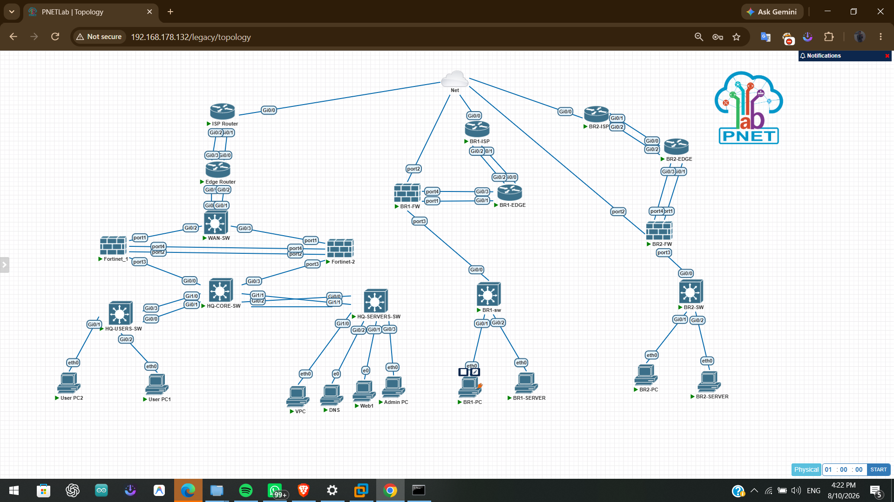

# Enterprise Network Security Project

A multi-site enterprise network security implementation built and simulated using PNETLab and FortiGate.

## Project Overview

This project implements a segmented, secure, redundant, and manageable enterprise network consisting of:

- Headquarters (HQ)
- Branch 1
- Branch 2
- WAN and Internet connectivity
- FortiGate High Availability
- VLAN-based network segmentation
- Inter-VLAN routing
- Static routing
- Site-to-site IPsec VPN
- Firewall security controls

The lab was designed to simulate an enterprise environment and demonstrate practical network engineering and cybersecurity concepts.

---

## Network Architecture

The topology consists of a centralized HQ connected to multiple branch networks through simulated WAN infrastructure.

### Headquarters

- HQ ISP
- HQ Edge Router
- HQ FortiGate HA Cluster
- Core Switch
- Access Switches
- Users VLAN
- Servers VLAN
- Management VLAN

### Branches

- Branch 1 ISP and Edge Router
- Branch 1 FortiGate
- Branch 1 LAN
- Branch 2 ISP and Edge Router
- Branch 2 FortiGate
- Branch 2 LAN

### Topology



The complete PNETLab topology is provided in the `.unl` file.

---

## Network Segmentation

The HQ network is segmented using VLANs:

| VLAN | Purpose | Network |
|------|---------|---------|
| VLAN 10 | Users | 192.168.10.0/24 |
| VLAN 20 | Servers | 192.168.20.0/24 |
| VLAN 30 | Management | 192.168.30.0/24 |

Branch networks use separate address ranges to avoid overlap between sites.

---

## IP Addressing

The project uses private RFC1918 addressing.

### HQ Networks

| Network | Purpose |
|---------|---------|
| 192.168.10.0/24 | HQ Users |
| 192.168.20.0/24 | HQ Servers |
| 192.168.30.0/24 | HQ Management |

### Branch 1 Networks

| Network | Purpose |
|---------|---------|
| 192.168.110.0/24 | Branch 1 Users |
| 192.168.120.0/24 | Branch 1 Servers |

### WAN

WAN point-to-point links use `/30` networks, while internal LAN segments use `/24` networks.

This addressing approach provides:

- Clear network separation
- Easier routing
- Simplified troubleshooting
- Non-overlapping site networks
- Room for future expansion

---

## Routing

Static routing is used across the current topology because the network is relatively small and the paths are predictable.

Routing is configured to provide connectivity between:

- HQ internal networks
- Branch 1 networks
- Branch 2 networks
- WAN transit networks
- Internet-facing infrastructure

---

## High Availability

The HQ FortiGate firewalls are configured in an Active-Passive High Availability cluster.

```text
                HQ Network
                    |
          +---------+---------+
          |                   |
   HQ-FW-Primary       HQ-FW-Secondary
      Active                Passive
          |
       HA Sync
```

HA provides firewall redundancy and allows the secondary unit to take over if the primary unit fails.

The HA configuration was validated with both cluster members synchronized and the cluster operating in Active-Passive mode.

---

## IPsec VPN

Site-to-site IPsec VPN is used to provide secure communication between HQ and branch networks.

The VPN design separates traffic between different network segments, including:

- HQ Users ↔ Branch 1 Users
- HQ Servers ↔ Branch 1 Servers

The project uses IKEv2 for VPN negotiation.

---

## Security

FortiGate is used as the central security enforcement point.

The security architecture includes:

- Firewall Policies
- NAT
- VIP
- IPS
- Antivirus
- Web Filtering
- Application Control
- VPN Security
- Network Segmentation

---

## Technologies

### Network Infrastructure

- FortiGate-VM64-KVM
- PNETLab
- Cisco Networking Devices
- VLAN
- 802.1Q Trunking
- Inter-VLAN Routing
- Static Routing

### Security

- FortiGate HA
- Firewall Policies
- NAT
- VIP
- IPS
- Antivirus
- Web Filtering
- Application Control
- IPsec VPN
- UTM Security Controls

---

## Repository Structure

```text
HQ-Enterprise-Security/
│
├── README.md
├── HQ_Enterprise_1786111675435_1786121515211.unl
├── Enterprise-Network-Security-Report.docx
│
└── screenshots/
    └── topology.png
```

---

## How to Run the Lab

### Requirements

- PNETLab
- Required FortiGate images
- Required Cisco/network images
- The provided `.unl` topology file

### Steps

1. Import the `.unl` file into PNETLab.
2. Make sure the required network images are installed.
3. Start the topology.
4. Verify device interfaces and connectivity.
5. Verify VLAN configuration and routing.
6. Verify the FortiGate HA cluster.
7. Verify IPsec VPN status.
8. Perform the connectivity tests documented in the project report.

---

## Project Documentation

The complete technical documentation is available in:

`Enterprise-Network-Security-Report.docx`

The documentation contains the project architecture, configurations, addressing scheme, security design, testing, and implementation evidence.

---

## Project Team

This project was developed collaboratively as a three-member enterprise network security team.

### Mahmoud Elfarsy — Network Infrastructure

[@MahmoudElfarsy](https://github.com/MahmoudElfarsy)

Responsible for:

- HQ infrastructure
- Core switching
- Access switching
- VLANs
- DHCP
- Inter-VLAN routing
- HQ static routing
- HA interface preparation
- Routing
- HA configuration
- Security testing

### Menna Moutafa — WAN & Connectivity

[@mennamoutafa321](https://github.com/mennamoutafa321)

Responsible for:

- Branch 1
- Branch 2
- WAN connectivity
- IPsec VPN
- Remote VPN


### Lana Omran — Security

[@lanaomran](https://github.com/lanaomran)

Responsible for:

- Firewall policies
- NAT
- VIP
- IPS
- Antivirus
- Web Filtering
- Application Control
- Documentation

---

## Project Status

The repository contains:

- The complete PNETLab topology
- Project documentation
- Network topology screenshot
- Network architecture and addressing information

Configuration and testing details should be referenced from the accompanying technical report.

---

## Disclaimer

This project was developed in a controlled lab environment for educational and practical cybersecurity and network engineering purposes.
